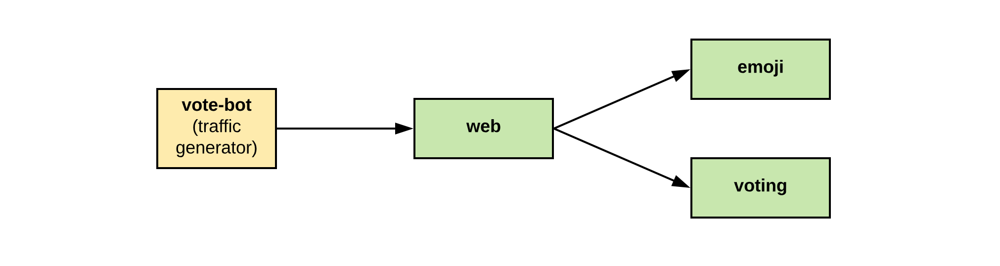

# Service Mesh demo with Linkerd Emojivoto demo app

## Requirements

- [kubectl](https://kubernetes.io/docs/tasks/tools/) version `v1.24.x`
- [minikube](https://minikube.sigs.k8s.io/) version `v1.26.1`
  - with configured [docker driver](https://minikube.sigs.k8s.io/docs/drivers/docker/)
- [linkerd CLI](https://linkerd.io/2.12/getting-started/) version `stable-2.11.5`

## Configration options

**Export** one of the following environment variables to configure the scripts. Make sure to always use the same set of variables.

| Variable name     | Default value | Description                              |
| ----------------- | ------------- | ---------------------------------------- |
| `MK_PROFILE_NAME` | `linkerd`     | The name of the minikube profile/cluster |

## emojivoto topology

:arrow_right: image taken from: [BuoyantIO/emojivoto]([https://](https://github.com/BuoyantIO/emojivoto))

---

## :hatching_chick: Setup the minikube cluster with Linkerd

1. Start Docker.
1. Ensure that minikube is configured to use the Docker driver.
1. Execute [00_setup_cluster_and_linkerd.sh](./00_setup_cluster_and_linkerd.sh) to spin up a minikube cluster/profile with Linkerd and the Emojivoto demo app installed.

## :postbox: Deploy the bare emojivoto app

**FYI: This script can be re-run infinitely.**

1. Execute [01_install_emojivoto.sh](01_install_emojivoto.sh).
1. After that [expose the app](#expose-the-emojivoto-app-and-forward-the-viz-dashboard).

## :link: Mesh the emojivoto app

**FYI: This script can be re-run infinitely.**

1. Execute [02_mesh_emojivoto.sh](02_mesh_emojivoto.sh).
1. After that [expose the app](#expose-the-emojivoto-app-and-forward-the-viz-dashboard).

## :globe_with_meridians: Expose the emojivoto app and forward the viz dashboard

1. Start a new terminal.
1. Execute [10_run_dashboard_and_app.sh](10_run_dashboard_and_app.sh).
1. Access the Linkerd dashboard and the demo app via the printed URLs.
1. Kill the terminal to stop the forwards.

## :recycle: Clean-up

1. Ensure the right variables are exported.
1. Execute [90_delete_minikube_cluster.sh](./90_delete_minikube_cluster.sh).
1. Your cluster should be gone.

---

## :clipboard: References

- [minikube docs](https://minikube.sigs.k8s.io/docs/)
- [Linkerd docs](https://linkerd.io/docs/)
- [emojivoto sources]([https://](https://github.com/BuoyantIO/emojivoto))
